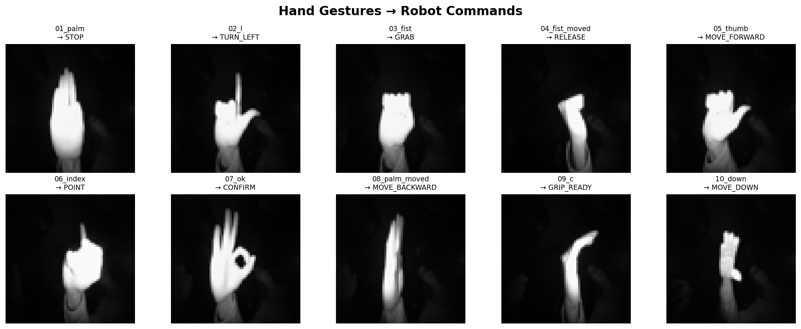
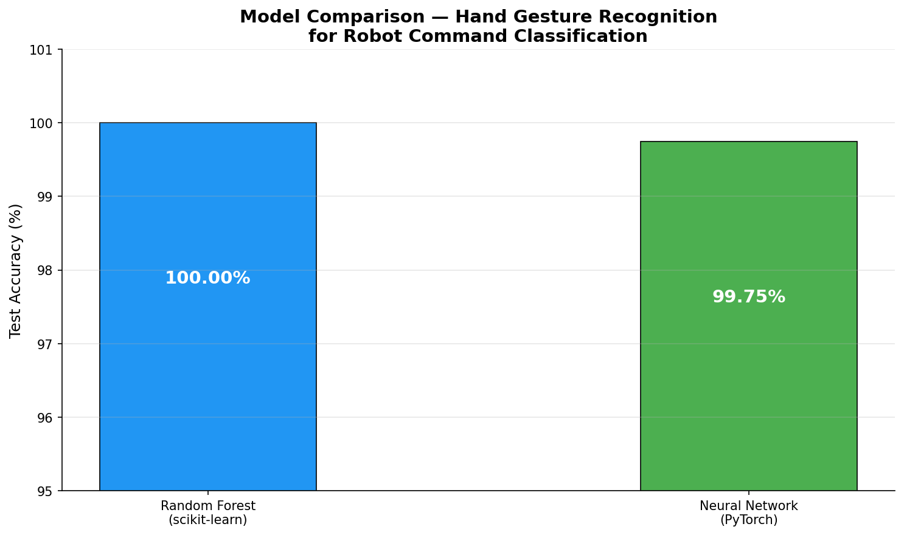
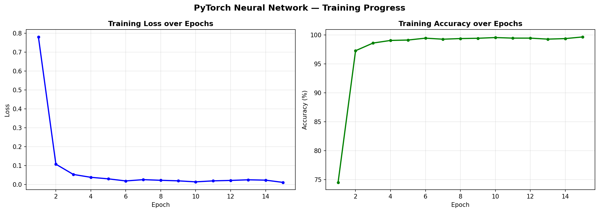
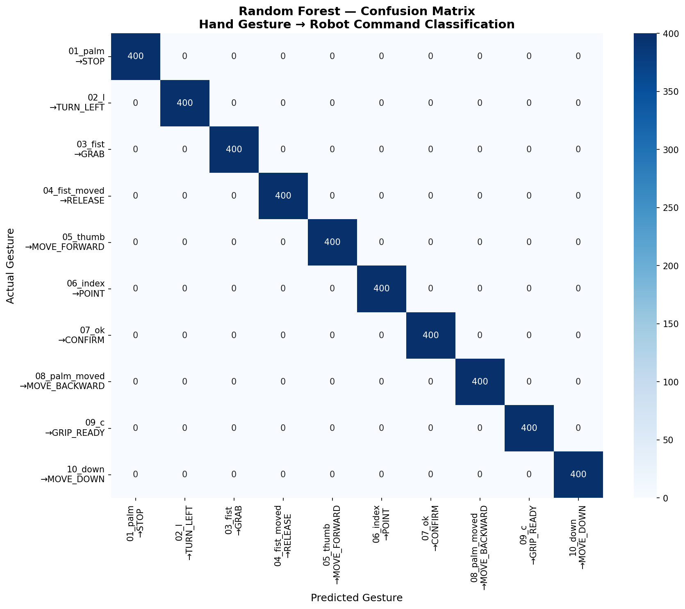

# Hand Gesture Robot Control 🤖

A machine learning system that recognises hand gestures and maps them to robot commands, 
comparing classical ML (Random Forest) and deep learning (PyTorch) approaches.

## Robot Command Mapping
| Gesture | Robot Command |
|---------|--------------|
| Palm | STOP |
| L | TURN_LEFT |
| Fist | GRAB |
| Fist Moved | RELEASE |
| Thumb | MOVE_FORWARD |
| Index | POINT |
| OK | CONFIRM |
| Palm Moved | MOVE_BACKWARD |
| C | GRIP_READY |
| Down | MOVE_DOWN |

## Results
| Model | Test Accuracy |
|-------|--------------|
| Random Forest (scikit-learn) | 100.00% |
| Neural Network (PyTorch) | 99.75% |

## Dataset
[LeapGestRecog](https://www.kaggle.com/datasets/gti-upm/leapgestrecog) — 
20,000 images across 10 gesture classes from 10 subjects.

## Model Architecture
**Neural Network (PyTorch):**
- Input: 4096 features (64×64 grayscale image)
- Hidden Layer 1: 512 neurons + ReLU + Dropout(0.3)
- Hidden Layer 2: 128 neurons + ReLU + Dropout(0.3)
- Output: 10 classes

## Visualisations

## Tech Stack
- Python 3.12
- scikit-learn
- PyTorch
- NumPy, Pandas, Matplotlib, Seaborn
- PIL
